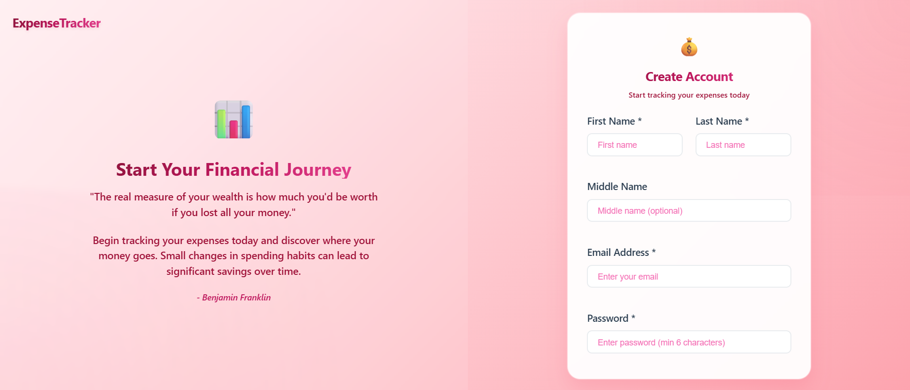
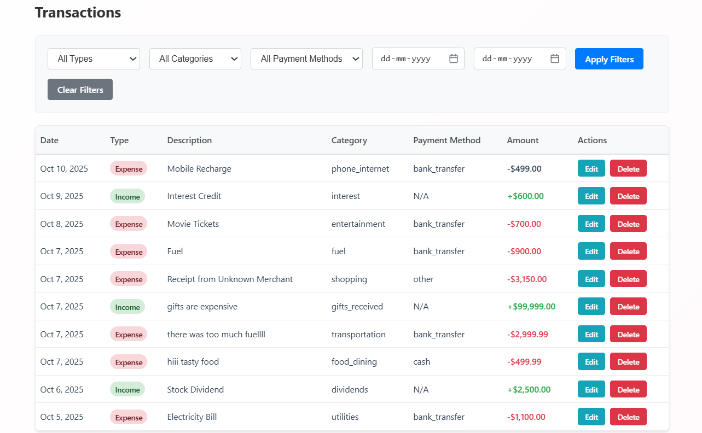
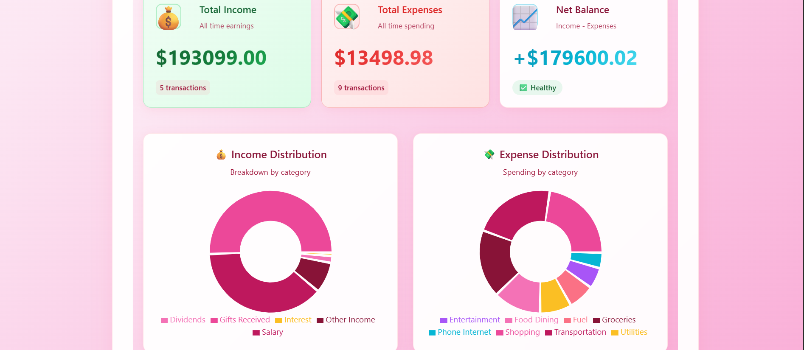
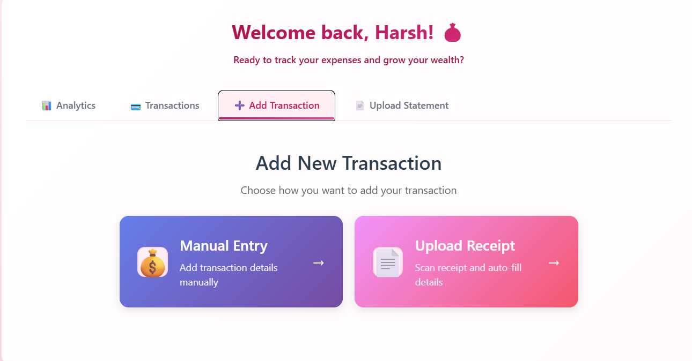
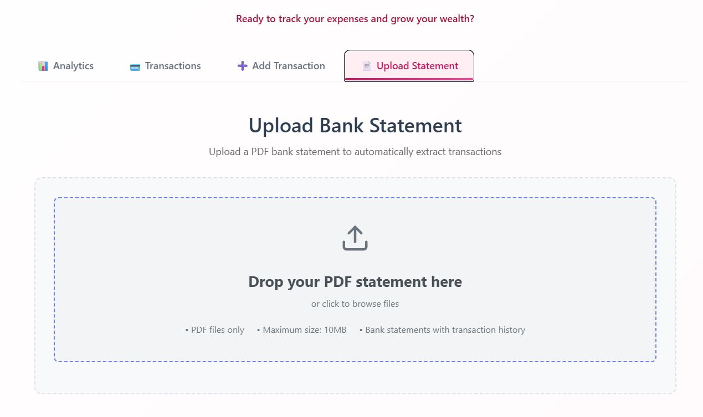

# Typeface Expense Tracker

This is a comprehensive expense tracking application designed to help users manage their finances efficiently. It features a modern, service-oriented architecture and provides powerful tools for tracking, analyzing, and automating financial data entry.

## Overview

This project is a full-stack expense tracking application built on a **Service-Oriented Architecture (SOA)**. It allows users to monitor their income and expenses, visualize their spending habits through dynamic graphs, and automatically extract transaction data from uploaded documents like receipts and bank statements.

The application is logically divided into three core backend services:
1.  **Authentication Service**: Manages user registration, login, and secures the application by authenticating users.
2.  **Expense Tracker Service**: The primary service that handles all core functionalities, including transaction management, financial analytics, and OCR-based data extraction.
3.  **Notification Service**: A service designed to handle user notifications (e.g., via email). While implemented, it is not yet fully integrated into the main application flow.

## Tech Stack

This project is built using the **MERN** stack, a powerful and popular technology combination for building scalable and maintainable full-stack web applications.

*   **MongoDB**: A flexible NoSQL, document-oriented database used to store all application data, including user credentials, transactions, and processed document information.
*   **Express.js**: A minimal and robust Node.js web application framework that provides the foundation for building the RESTful APIs for our backend services.
*   **React.js**: A declarative JavaScript library for building interactive user interfaces. It is used to create a fast, responsive, and modern single-page application for the frontend.
*   **Node.js**: A JavaScript runtime built on Chrome's V8 engine, which allows us to run JavaScript on the server-side to power all our backend services.

## Key Functionalities

*   **Manual Transaction Management**: Ability to create, read, update, and delete income and expense entries through an intuitive web interface.
*   **Filtered Transaction History**: List and filter all income and expenses within a specified time range.
*   **Data Visualization**: Interactive charts and graphs to provide insights into financial data, including:
    *   Expenses broken down by category.
    *   Financial trends over a selected period.
*   **Receipt OCR**: Upload a receipt (as an image or PDF) and automatically extract key details like merchant name, date, and total amount to create a new transaction.
*   **Bank Statement Processing**: Upload a transaction history from a PDF bank statement (in tabular format) to automatically import multiple transactions at once.
*   **API Pagination**: All list-based APIs support pagination to ensure efficient and scalable data loading on the frontend.
*   **Multi-User Support**: The application is designed for multiple users, ensuring that each user's financial data is kept private and secure.

## Advanced Features

*   **Global Error Handling**: Each backend service is equipped with a centralized error handling middleware. This ensures that all errors are caught and processed consistently, returning clean, formatted error messages to the client without crashing the server.
*   **API Rate Limiting**: To protect the services from brute-force attacks and abuse, rate limiting is implemented on sensitive endpoints, such as login and registration.
*   **Advanced OCR and AI-Powered Data Extraction**:
    *   The OCR pipeline utilizes a **Hugging Face Transformers model** to perform robust text extraction from uploaded receipts and statements.
    *   Following the initial OCR, the extracted text is passed to **Google's Gemini model** for semantic analysis. Gemini interprets the unstructured text, identifies key financial entities (like merchant, total amount, date, and line items), and structures it into a clean JSON format, which is then used to pre-fill transaction data for the user.

## Architecture

The application utilizes a microservices-style architecture, with **Nginx** acting as a reverse proxy to manage and route incoming requests to the appropriate backend service.

*   **Nginx (Reverse Proxy)**: Listens on port `80` and forwards client requests to the correct service. It is responsible for routing, load balancing (if scaled), and handling Cross-Origin Resource Sharing (CORS).
*   **Authentication Service**: Runs on port `3001`.
*   **Expense Tracker Service**: Runs on port `3002`.
*   **Notification Service**: Runs on port `3003`.

All services are containerized using **Docker**, which simplifies the development setup, ensures consistency across environments, and makes the application easy to deploy.

## Project Structure

The project is organized into two main folders: `frontend` and `backend`.

### Backend Structure

The backend follows a service-oriented architecture, with each service contained in its own directory.

```
backend/
├── docker-compose.yml            # Docker Compose file to orchestrate all services
├── AuthenticationService/        # Handles user authentication and JWT management
│   ├── app.js                    # Service entry point
│   ├── Dockerfile
│   ├── package.json
│   ├── config/                   # Database and environment configuration
│   ├── controllers/              # Request handling logic
│   ├── middlewares/              # Express middlewares (e.g., error handling)
│   ├── models/                   # Mongoose data models (e.g., User)
│   └── routes/                   # API route definitions
├── expense-tracker-service/      # Core service for managing transactions and analytics
│   ├── Dockerfile
│   ├── package.json
│   └── src/
│       ├── server.js             # Service entry point
│       ├── constants/
│       ├── controllers/          # Business logic for transactions, OCR, analytics
│       ├── middleware/           # File upload handling (multer), error handling
│       ├── models/               # Mongoose data models (e.g., Transaction)
│       ├── routes/               # API routes for expenses, receipts, etc.
│       └── utils/                # Utility scripts, including the Python OCR scripts
├── nginx/                        # Nginx reverse proxy configuration
│   ├── Dockerfile
│   └── nginx.conf                # Routing rules for the services
└── NotificationService/          # Handles sending notifications (e.g., email)
    ├── app.js                    # Service entry point
    ├── Dockerfile
    ├── package.json
    └── services/                 # Email and Kafka consumer logic
```

### Frontend Structure

The frontend is a standard Vite-based React application.

```
frontend/
├── public/                       # Static assets
├── src/
│   ├── assets/                   # Images and other static assets
│   ├── components/               # Reusable React components
│   │   ├── Auth/                 # Login and Signup components
│   │   ├── Analytics.jsx
│   │   ├── Dashboard.jsx
│   │   └── ...
│   ├── services/                 # Functions for making API calls to the backend
│   │   ├── analyticsService.js
│   │   ├── authService.js
│   │   └── ...
│   ├── App.jsx                   # Main application component with routing
│   └── main.jsx                  # Application entry point
├── index.html                    # Main HTML file
├── package.json
└── vite.config.js                # Vite configuration
```

## Running the Application

The application consists of backend services and a frontend client, which can be run separately.

### Running the Backend Services

The backend services are containerized and managed with Docker Compose.

1.  **Prerequisites**:
    *   [Docker](https://www.docker.com/get-started) must be installed and running on your machine.

2.  **Navigate to the `backend` directory:**
    ```bash
    cd backend
    ```

3.  **Start all services:**
    Use Docker Compose to build and run all the services in detached mode.
    ```bash
    docker-compose build
    docker-compose up -d
    ```
    This command will start the Nginx proxy, all three backend services, and the MongoDB database. The backend API gateway will then be accessible at `http://localhost:80`.

### Running the Frontend Application

The frontend is a React application built with Vite and can be run locally for development.

1.  **Prerequisites**:
    *   [Node.js](https://nodejs.org/) (which includes npm) must be installed on your machine.

2.  **Navigate to the `frontend` directory:**
    ```bash
    cd frontend
    ```

3.  **Install dependencies:**
    ```bash
    npm install
    ```

4.  **Run the development server:**
    ```bash
    npm run dev
    ```
    The frontend application will now be running and accessible at `http://localhost:5173`.

## Application Screenshots

Here are some screenshots showcasing the application's features:

### User Authentication
**Login Page**


**Signup Page**


### Core Features
**Transaction List**


**Financial Analytics**


### Automated Data Entry
**Receipt Upload and OCR**


**Bank Statement Upload**


